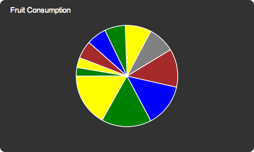
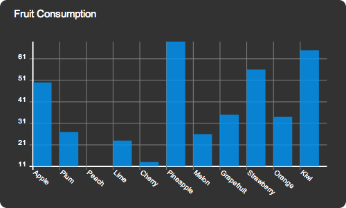
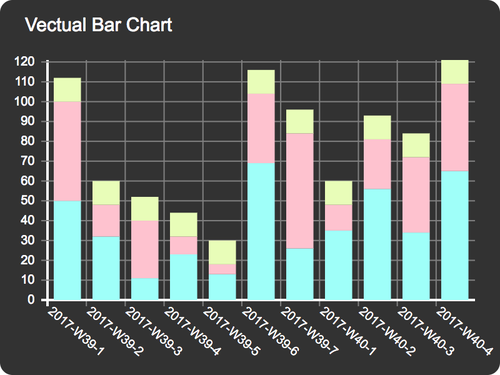
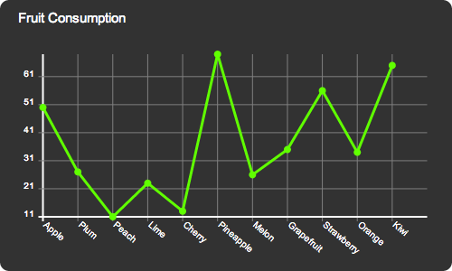
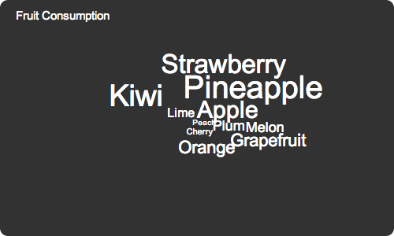

# Vectual

A simple to use charting library. It visualizes data and helps you to understand it.

**Attention:**
This software is still a alpha version. It might not work as expected and the API may change at any time.

## Good Looking

Display beautiful charts and customise them to fit perfectly to your needs.

## Visualisations

### Pie chart

The most ubiquitous chart with an amazing fan out animation.
You can also explode certain sectors to highlight them.

### Bar chart

The right tool to display few data clearly arranged but still appealing

#### Stacked

### Line chart

Watch your stocks reaching new heights.
You can also hover the chart to get detailed Information.

### Tag cloud

Need a short overview on whats hot or not?
Then you might like the awesome tag cloud feature.

### Map

Is my video more popular in Asia or in Europe?
It's never been easier to display the answer.

### Table

There is nothing more convenient than a simple table to display exact values.
Customise it to show just the relevant information.

### Export

You want to integrate the pretty charts in your e-mails, presentations or e-books?
No problem! Export them as svg images!

## Usage

1. Load `vectual.css` in the head tag of your website

1. Include [Shaven](https://github.com/adius/shaven)

1. Include `vectual.js` (or `vectual.min.js`) after DOMinate and before your code to draw the graphs

To draw a vectual graph with the default configuration (in vectual.js) simply invoke it like this:

  vectual(data).pieChart()

Alternative visualizations are:

- `.barChart()`
- `.lineChart()`
- `.tagCloud()`
- `.scatterChart()`
- `.map()`
- `.table()`

