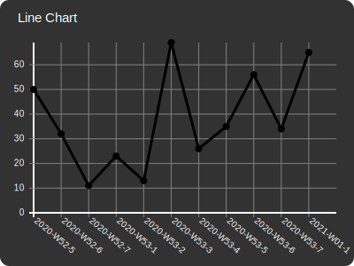
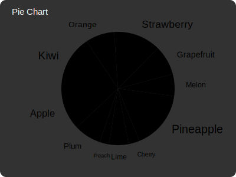
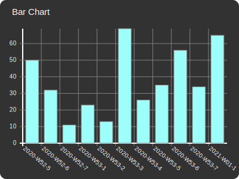
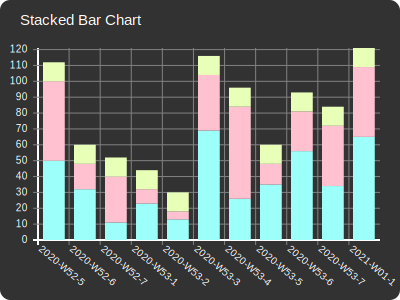
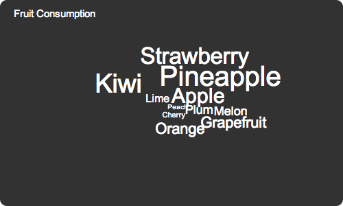

# Vectual

A simple to use charting library written in Elm.
It visualizes data and helps you to understand it.
Display beautiful charts and customize them in various ways.

**Attention:** \
This software is still a alpha version.
It might not work as expected and the API may change at any time.
For a live example page, check out [vectual.org](https://vectual.org).

Currently it supports line charts, pie charts,
bar charts, and stacked bar charts.

## Visualizations

<table>
  <tr>
    <td width="50%">
      
      

        Watch your stocks reaching new heights.
        You can also hover the chart to get detailed information.
      

    </td>
    <td width="50%">
      
      

        The most ubiquitous chart with an amazing fan out animation.
        You can also explode certain sectors to highlight them.
      

    </td>
  </tr>
  <tr>
    <td width="50%">
      
      

        The right tool to display little data clearly arranged,
        but still appealing.
      

    </td>
    <td width="50%">
      
      

        Also available as a stacked variant to compare several series,
        while also keeping an eye on the combined values.
      

    </td>
  </tr>
</table>

## Coming Soon

### Tag Cloud

Need a short overview on whats hot or not?
Then you might like the awesome tag cloud feature.

### Map

Is my video more popular in Asia or in Europe?
It's never been easier to display the answer.

### Table

There is nothing more convenient than a simple table to display exact values.
Customize it to show just the relevant information.

### Export

You want to integrate the pretty charts in your e-mails,
presentations or e-books?
No problem! Export them as SVG images!

## Related

- [Elm Visualization] - A data visualization library for Elm.

[Elm Visualization]: https://github.com/gampleman/elm-visualization
